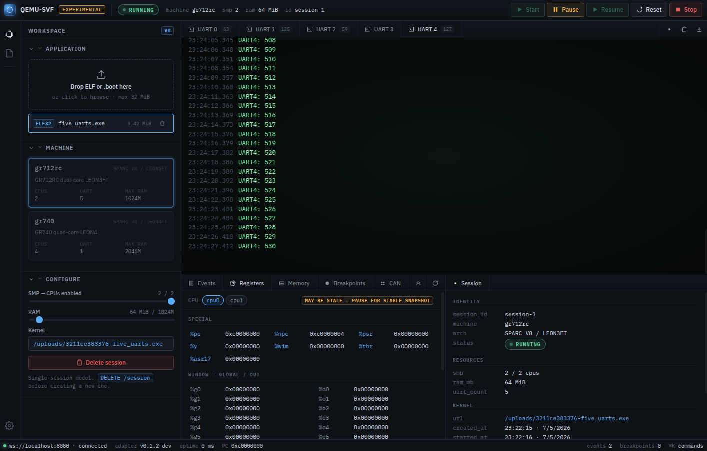

# GR712RC / GR740 QEMU Emulator

QEMU emulation of two Cobham Gaisler space-grade SoCs, targeting
[RTEMS](https://www.rtems.org/) 5 applications built with the
[RCC 1.3.2](https://www.gaisler.com/index.php/downloads/compilers)
(RTEMS Compiler Collection) toolchain:

- **`-M gr712rc`** — dual-core LEON3FT
- **`-M gr740`** — quad-core LEON4 (NGMP)

Both machine types are implemented as patches on top of QEMU 8.2.2 and live in
the [`qemu/`](https://github.com/nhorro/qemu-gr712rc-fork) submodule.

## Documentation

### Architecture & internals

- [QEMU primer](01-qemu-primer.md) — QEMU architecture explained for
  TSIM / TEMU / GRSIM users: TCG, QOM, `MemoryRegion`, `qemu_irq`, timers,
  and how a bus cycle travels from RTEMS to a device and back.
- [Code map](02-code-map.md) — where things live: relevant files in the QEMU
  tree, the GR712RC / GR740 memory maps, RTEMS BSP sources worth reading,
  and the Kconfig / Meson build wiring.
- [Adding a peripheral](03-adding-a-peripheral.md) — step-by-step walkthrough
  for adding a new GRLIB APB device, including build-system integration,
  APB PnP registration, IRQ wiring, and timer-driven devices.
- [Debugging](04-debugging.md) — GDB remote debugging, QEMU monitor
  commands, the trace subsystem, quick `fprintf` instrumentation, and a
  catalogue of common failure modes with root causes and fixes.
- [Contributing](05-contributing.md) — Git workflow for this repo: cloning
  with submodules, editing QEMU source and committing to the fork, updating
  the submodule pointer, toolchain setup, and rebasing on upstream QEMU
  releases.

### Interfaces

- [UART socket interface](06-uart-socket-interface.md) — connecting external
  simulators to APBUARTs 1–4 via TCP socket backends; raw byte-stream
  protocol; extending the convention to CAN and SpaceWire.
- [Adapter API](07-adapter-api.md) — v0 HTTP/WebSocket contract for the
  FastAPI service that wraps `qemu-system-sparc` and exposes it to UIs and
  external models.
- [Running the service](08-running-the-service.md) — operator walkthrough
  for starting the adapter + bundled React UI, both natively and via Docker
  Compose.
- [Portable export](09-portable-export.md) — packaging the full
  emulator + UI as a `docker save` tarball for demoing on a fresh PC with
  no source.
- [Embedding as library](11-embedding-as-library.md) — running the
  emulator inside another program by linking `libqemu-sparc.so` and
  driving QEMU step-by-step from the host's own `main()`. Covers the SDK
  header `libqemu.h`, the example wrapper, the granularity sweep that
  froze the operating point at 1 ms REALTIME, and the bundled timing
  examples.

### Hardware reference

- [GR740 IP cores](10-gr740-ipcores.md) — emulation status and strategy
  for every IP core in the GR740 datasheet, with difficulty ratings.

## Source

Source code, issue tracker, and CI live on
[GitHub](https://github.com/nhorro/gr712rc-emulator-qemu).
